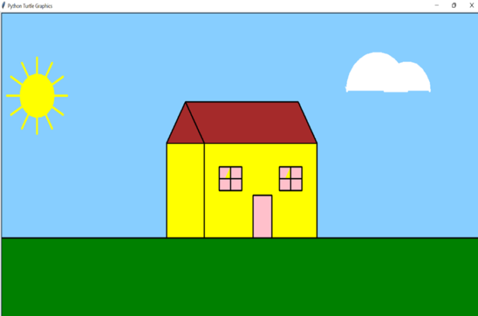
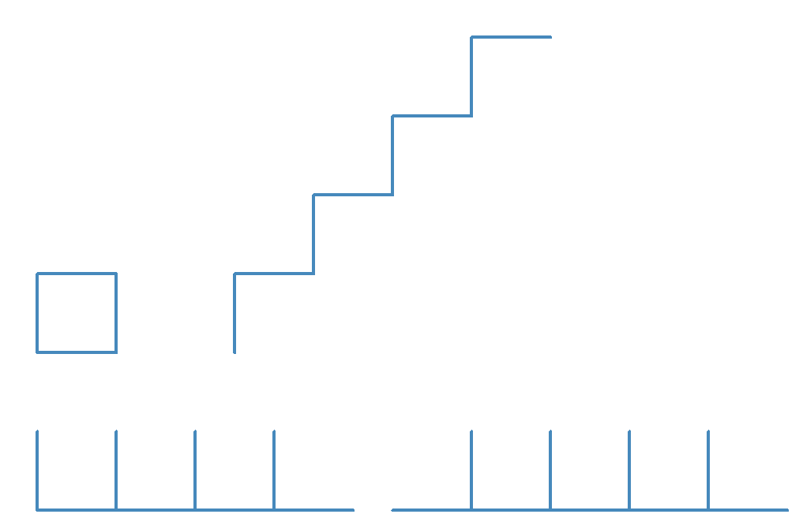

# Introducción a Python

## Semana 2

 <!-- .element style="margin-left: auto; margin-right: auto; display: block" -->

Notes:
Pasar la [encuesta](https://forms.gle/62m79xAeYoMCi8WV8)

---

 <!-- .element style="margin-left: auto; margin-right: auto; display: block" -->

---

# Tenemos un plan

 <!-- .element class="medium right" -->

### Parte I: programación
- Python básico
- Algoritmos
- Herramientas de programación (git, tests, etc.)
- Proyecto final: juego
- Proyecto extra: bot de Telegram

### Parte II: Inteligencia Artificial
- Introducción a la IA
- Modelos con Tensorflow / Pytorch
- Proyecto final: reconocimiento de fotografías


---


### La programación son cinco cosas

1. Secuencia
2. Condicionales
3. Repetición
4. Variables
5. Funciones


---

# ¡A pintá!


 <!-- .element class="big center" -->

--

[https://pythonandturtle.com/turtle](https://pythonandturtle.com/turtle)

### Estructura básica de código


```python [0|1-2|4-14|16]
# Turtle script example
t = turtle.Turtle('turtle')

t.width(1)
t.speed (1)
t.color('red')

t.forward(50)

for i in range(4):
  t.forward(100)
  t.left(90)

t.backward(50)

turtle.done()
```

- Inicialización (siempre igual)
- Hacer cosas
- Terminar (siempre igual)


--

### Mover la tortuga

- Velocidad

```python
t.speed(1) # 1 lento, 500 rápido
```

- Avanzar / Retroceder:

```python
t.forward(50)
t.backward(50)

t.forward(-50)
t.backward(-50)
```

- Girar. En º y admite negativos:


```python
t.left(90)
t.right(45)
```

- Control del lápiz

```python
t.penup()
t.pendown()
t.color('red')
```

--

# Pues a pintá

[https://pythonandturtle.com/turtle](https://pythonandturtle.com/turtle)
<!-- .element class="centered" style="margin-top: -3rem;" -->

**OJO**: las mayúsculas/minúsculas son importantes
<!-- .element class="centered" -->

**OJO**: la alineación del código es importante
<!-- .element class="centered" -->

 <!-- .element class="noborder center" -->

- *Extra*: Dibuja un triángulo isósceles
- *Super extra*: Dibuja un triángulo isósceles... y no lo hagas "a ojo"

Note:
- Ejemplo: cuadrado
https://docs.python.org/3/library/turtle.html#turtle-graphics-reference

---

# Repeticiones

```python [0|1-2|5-8|5|6-8|10-11]
# Hago cosas antes
t.forward(100)

# Repito tres veces
for num_vuelta in range(3):
    # Esto es lo que se repite, ojo a la identación
    t.forward(100)
    t.left(90)

# Luego puedo hacer más cosas
t.forward(100)
```
<!-- .element style="font-size: 0.8em" -->

- Se pueden hacer cosas antes
- La alineación nos dice lo que va "dentro" del `for`
- Después de repetir, el programa continuará como si tal cosa

---

# A pintá

[https://pythonandturtle.com/turtle](https://pythonandturtle.com/turtle)
<!-- .element class="centered" style="margin-top: -3rem;" -->


 <!-- .element class="noborder center" -->

---

# Expresiones

[https://www.pythonmorsels.com/repl/](https://www.pythonmorsels.com/repl/)

- Puedo utilizar funciones "de calculadora"
- Ojo a la precedencia de operadores: los paréntesis nunca están de más.
- No todo son números

Notes:
Precedencia:
- `1+2*6`
- `10/2*5`

---

# Variables

[https://pythonandturtle.com/](https://pythonandturtle.com/)

```python
mi_variable = 3
print(mi_variable)

mi_variable = 4
print(mi_variable)

# ----------------------

print(mi_variable * 5 + 2)

mi_variable = 10
mi_otra_variable = 7 * mi_variable + 100 / mi_variable
print(mi_otra_variable)

# ----------------------

mi_variable = 16
mi_variable = 16 * mi_variable
print(mi_variable)
```
<!-- .element style="font-size: 0.7em" -->

- Las variables pueden guardar cosas
- Las variables se pueden cambiar
- Se pueden utilizar variables en expresiones
- Se pueden usar una variable a la izquierda y a la derecha

---

## Vuelta al `for`


```python
lado = 10
vueltas = 3
for num_vuelta in range(vueltas):
    t.forward(num_vuelta * lado)
    t.left(90)
```
<!-- .element style="font-size: 1em" -->

- Puedo usar variables para pintar
- Puedo acceder a `num_vuelta` dentro del bucle (no hace falta que se llame `num_vuelta`)
- Empieza en cero
- ¿Qué pintará esto?


--

# A pintá

```
lados = 4
largo_lado = 100

# Aquí tu código
```
<!-- .element style="font-size: 1em" -->

- Pinta un polígono de ese número de lados y con esa longitud
- Tiene que funcionar sin tener que modificar el programa aunque cambies las variables

 <!-- .element class="noborder center" -->

**Pista**: En un polígono regular todos los ángulos internos son iguales
y la suma es igual a 180° × (lados – 2).


**Extra**: Haz que en la base vaya un vértice, no una arista

---

# A pintá

 <!-- .element class="noborder center" -->

 <!-- .element class="noborder center" -->

---

# A almorzá

- Presentación: [https://avast-python.github.io/semana-1/](https://avast-python.github.io/semana-1/)
- Soluciones: [https://github1s.com/AVAST-Python/semana-1](https://github1s.com/AVAST-Python/semana-1)


